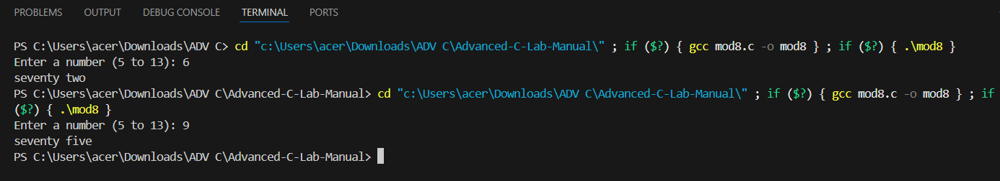
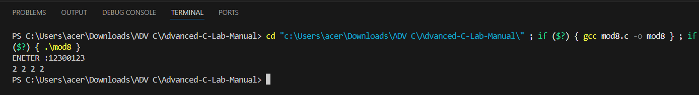
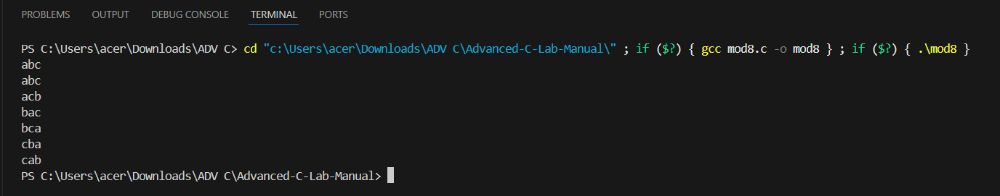
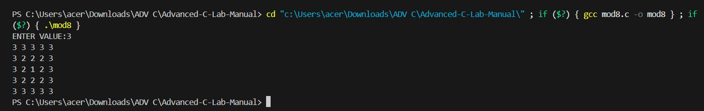
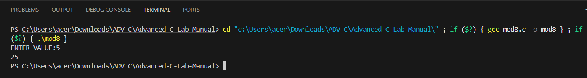

EXP NO:6 C PROGRAM PRINT THE LOWERCASE ENGLISH WORD CORRESPONDING TO THE NUMBER
Aim:
To write a C program print the lowercase English word corresponding to the number
Algorithm:
1.	Start
- Initialize an integer variable n.
2.	Input Validation
3.	Switch Statement cases.
-	Case 5: Print "seventy one"
-	Case 6: Print "seventy two"
-	Case 13: Print "seventy three"
-	...
-	Case 13: Print "seventy nine"
-	Default: Print "Greater than 13"
4.	Exit the program.
 
Program:

```
#include <stdio.h>

int main() {
    int n;
    printf("Enter a number (5 to 13): ");
    scanf("%d", &n);
    switch(n) {
        case 5:
            printf("seventy one");
            break;
        case 6:
            printf("seventy two");
            break;
        case 7:
            printf("seventy three");
            break;
        case 8:
            printf("seventy four");
            break;
        case 9:
            printf("seventy five");
            break;
        case 10:
            printf("seventy six");
            break;
        case 11:
            printf("seventy seven");
            break;
        case 12:
            printf("seventy eight");
            break;
        case 13:
            printf("seventy nine");
            break;
        default:
            printf("Greater than 13 or invalid input");
    }

    return 0;
}
```


Output:




Result:
Thus, the program is verified successfully
 
EXP NO:7 C PROGRAM TO PRINT TEN SPACE-SEPARATED INTEGERS     IN A SINGLE  LINE DENOTING THE FREQUENCY OF EACH DIGIT FROM 0 TO 3 .
Aim:
To write a C program to print ten space-separated integers in a single line denoting the frequency of each digit from 0 to 3.
Algorithm:
1.	Start
2.	Declare char array a[50] outer loop for each digit from 0 to 3
3.	Initialize counter c to 0
4.	For each character in the string print count c for current digit, followed by a space
5.	Increment h to move to the next digit
6.	End
 
Program:
```
#include <stdio.h>
#include <string.h>

int main() {
    char a[50];
    int i, c, d;
    printf("ENETER :");

    scanf("%s", a);

    for(d = 0; d <= 3; d++) {
        c = 0;
        for(i = 0; i < strlen(a); i++) {
            if(a[i] == d + '0')
                c++;
        }
        printf("%d ", c);
    }

    return 0;
}
```


Output:





Result:
Thus, the program is verified successfully

EXP NO:8 C PROGRAM TO PRINT ALL OF ITS PERMUTATIONS IN STRICT LEXICOGRAPHICAL ORDER.
Aim:
To write a C program to print all of its permutations in strict lexicographical order.

Algorithm:
1.	Start
2.	Declare variables s (pointer to an array of strings) and n (number of strings)

3.	Memory Allocation
Dynamically allocate memory for s to store an array of strings
4.	Input
Read the number of strings n from the user Dynamically allocate memory for each string in s
5.	Permutation Generation Loop
6.	Memory Deallocation
Free the memory allocated for each string in s Free the memory allocated for s
7.	End
 
Program:

```
#include <stdio.h>
#include <string.h>

void swap(char *a, char *b){
    char t=*a; *a=*b; *b=t;
}

void sort(char s[]){
    int i,j;
    for(i=0;s[i];i++)
        for(j=i+1;s[j];j++)
            if(s[i]>s[j]) swap(&s[i],&s[j]);
}

void perm(char s[], int l, int r){
    if(l==r) printf("%s\n",s);
    else{
        for(int i=l;i<=r;i++){
            swap(&s[l],&s[i]);
            perm(s,l+1,r);
            swap(&s[l],&s[i]);
        }
    }
}

int main(){
    char s[20];
    scanf("%s",s);
    sort(s);
    perm(s,0,strlen(s)-1);
}
```


Output:



Result:
Thus, the program is verified successfully
 
EXP NO:9 C PROGRAM PRINT A PATTERN OF NUMBERS FROM 1 TO N AS
SHOWN BELOW.
Aim:
To write a C program to print a pattern of numbers from 1 to n as shown below.
Algorithm:
1.	Start
2.	Declare integer variables n, i, j, min
3.	Read the value of n from the user
4.	Calculate the length of the side of the square matrix: len = n * 2 - 1
5.	Matrix Generation Loop
6.	Calculate min as the minimum distance to the borders
7.	End
 
Program:

```
#include <stdio.h>

int main() {
    int n, i, j, min, len;

    scanf("%d", &n);

    len = 2 * n - 1;

    for(i = 0; i < len; i++) {
        for(j = 0; j < len; j++) {
            min = i < j ? i : j;
            min = min < (len - i - 1) ? min : (len - i - 1);
            min = min < (len - j - 1) ? min : (len - j - 1);

            printf("%d ", n - min);
        }
        printf("\n");
    }

    return 0;
}
```


Output:




Result:
Thus, the program is verified successfully

EXP NO:10 C PROGRAM TO FIND A SQUARE  OF NUMBER USING FUNCTION WITHOUT ARGUMENTS WITH RETURN TYPE

Aim:

To write a C program that calculates the square of a number using a function that does not take any arguments, but returns the square of the number.

Algorithm:

1.	Start.
2.	Define a function square() with no parameters. This function will return an integer value.
3.	Inside the function:
o	Declare an integer variable to store the number.
o	Ask the user to input a number.
o	Calculate the square of the number (multiply the number by itself).
o	Return the squared value.
4.	In the main function:
o	Call the square() function and display the result.
5.	End.

Program:

```
#include <stdio.h>

int square() {
    int n;
    scanf("%d", &n);
    return n * n;
}

int main() {
    int result;
    result = square();
    printf("%d", result);
    return 0;
}
```


Output:





Result:
Thus, the program is verified successfully


